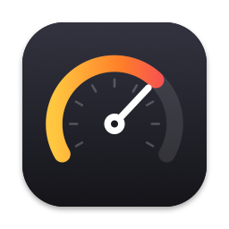
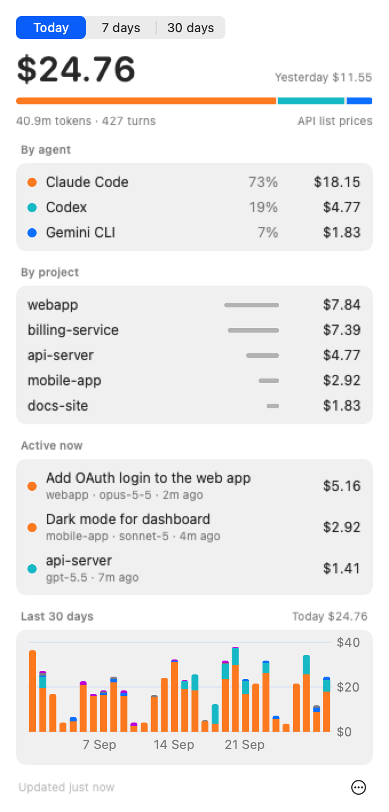
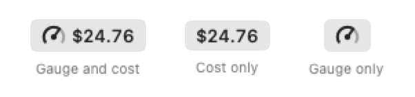
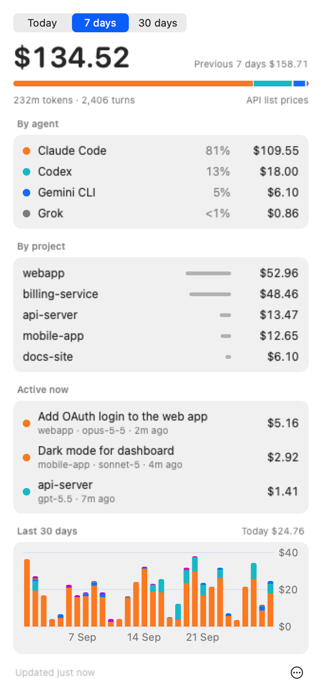

<p align="center">
  
</p>

<h1 align="center">Agent Meter</h1>

<p align="center">
  What your AI coding agents cost, live in the macOS menu bar.<br>
  Claude Code · Codex CLI · Gemini CLI · Grok CLI · opencode
</p>

<p align="center">
  
  
  
  
</p>

<p align="center">
  <picture>
    <source media="(prefers-color-scheme: dark)" srcset="docs/images/today-dark.png">
    
  </picture>
</p>

Agent Meter reads the logs your coding agents already write on your Mac and adds up what they would cost at API prices: today, this week and this month, by agent and by project. It's a native SwiftUI app of under 2,000 lines of Swift (plus a generated price table), and it idles at well under 1% CPU.

There's no account, API key or proxy, and nothing leaves your machine. (The one exception is an optional price update that you trigger yourself; see [Prices](#prices).)

## What it shows

<p align="center">
  <picture>
    <source media="(prefers-color-scheme: dark)" srcset="docs/images/menubar-dark.png">
    
  </picture>
</p>

- **Menu bar.** Today's spend with a gauge, or either one alone. The needle compares today with your daily budget, or with a typical day if you haven't set one, so a normal day points straight up. Gauge-only mode stays readable on a crowded, notched menu bar.
- **Today / 7 days / 30 days.** Totals with the previous period for comparison, and each agent's share.
- **By project.** Git worktrees count toward the repository they belong to.
- **Active now.** Sessions that billed a turn in the last 15 minutes, by title (Claude Code's own session titles, Gemini's summaries), with what each has cost today.
- **30-day chart.** Stacked by agent; hover a day to see its total.
- **Daily budget alert.** One notification on the day you cross it.

<p align="center">
  <picture>
    <source media="(prefers-color-scheme: dark)" srcset="docs/images/week-dark.png">
    
  </picture>
</p>

> [!NOTE]
> Costs are **API list prices**. If you're on a subscription (Claude Max, ChatGPT Pro, …), Agent Meter shows what the same usage would cost on the API, not what you paid. That's still the number to watch if you're deciding whether a plan pays off.

## Supported agents

| Agent | Reads | Notes |
|---|---|---|
| Claude Code | `~/.claude/projects/**/*.jsonl` | Includes subagents; honours `CLAUDE_CONFIG_DIR` |
| Codex CLI | `~/.codex/sessions/**/rollout-*.jsonl` | Honours `CODEX_HOME` |
| Gemini CLI | `~/.gemini/tmp/*/chats/*.jsonl` | |
| Grok CLI | `~/.grok/sessions/*/*/updates.jsonl` | |
| opencode | `~/.local/share/opencode/opencode*.db` | Uses opencode's own per-message cost; honours `XDG_DATA_HOME` |

All of these are opened read-only. Agent Meter never writes next to an agent's data. Agents that aren't installed are simply skipped, and one you install later is picked up within a minute.

## Install

You need macOS 14 or later and Swift 6. The Xcode Command Line Tools are enough (`xcode-select --install`).

```sh
git clone https://github.com/ra3orblade/agentmeter.git
cd agentmeter
tools/bundle.sh                       # builds dist/AgentMeter.app
mv dist/AgentMeter.app /Applications/
open /Applications/AgentMeter.app
```

On first launch it indexes the last 90 days of logs, which takes a few seconds per gigabyte. Turn on **Launch at login** from the ••• menu.

On a notched MacBook with a full menu bar, macOS can hide new items behind the notch. Agent Meter starts near the clock to avoid this; ⌘-drag it wherever you like.

## How it works

- **Incremental.** Each log is read from where the last pass stopped, and only complete lines are consumed. A half-written line waits for its newline.
- **Event-driven.** FSEvents reports which files changed, and only those are read. A full sweep runs once a minute as a safety net.
- **No double counting.** Each turn has a stable id (Claude's `message.id`, a fingerprint of Codex's usage event, and so on). Re-reading overwrites the same row, which also handles Claude's streamed responses, where the last usage wins.
- **Cache.** Turns and read positions live in `~/Library/Application Support/AgentMeter/meter.db`. It's derived data: delete it and it rebuilds from the logs.

The code is in two parts. `Sources/MeterCore` holds the parsers, pricing, scanner, SQLite cache, report and FSEvents watcher, with no UI. `Sources/AgentMeter` is the SwiftUI app.

## Prices

Prices come in three layers, and later layers win:

1. **Built in.** A snapshot of [LiteLLM's public price list](https://github.com/BerriAI/litellm/blob/main/model_prices_and_context_window.json), taken at build time, on top of a short list of model-family prefixes. A model newer than the snapshot (say `claude-opus-5-7`) still gets its family's price.
2. **Update prices from LiteLLM** (••• menu). Downloads the current list. This is the only network request Agent Meter makes, and only when you click it.
3. **Your overrides.** *Edit price overrides…* opens `pricing.json`, in USD per million tokens:

   ```json
   { "my-model": { "input": 1.0, "output": 2.0, "cacheWrite": 1.25, "cacheRead": 0.1 } }
   ```

Model ids match by longest prefix. Turns from a model with no known price still count their tokens and are flagged in the dropdown, so they never silently show as $0.

## Development

```sh
swift build
tools/test.sh                     # Swift Testing; works with only the Command Line Tools
tools/bundle.sh                   # release build → dist/AgentMeter.app (ad-hoc signed)
tools/screenshots.sh              # regenerate docs/images from synthetic logs
tools/snapshot-prices.py          # refresh the compiled-in price table from LiteLLM
```

- `tools/screenshots.sh` renders every image in this README from `tools/demo-data.py`. That script writes 30 days of fake sessions in each agent's real log format into a throwaway home folder, so the screenshots run through the real parsers and never show anyone's actual projects.
- `.build/debug/AgentMeter --snapshot out.png [--dark] [--period week]` renders the dropdown with your own data, which is handy when working on the layout.
- The app icon and the menu bar glyph both come from `Sources/AgentMeter/Logo.swift`, and the bundle script generates the `.icns` from it. There's no image file to keep in sync.

To add an agent, write a `LineParser` in `Parsers.swift` (one complete log line in, any finished turns out), add its root to `Scanner.roots`, and give it a test with a few real lines.

## License

[Apache-2.0](LICENSE)
